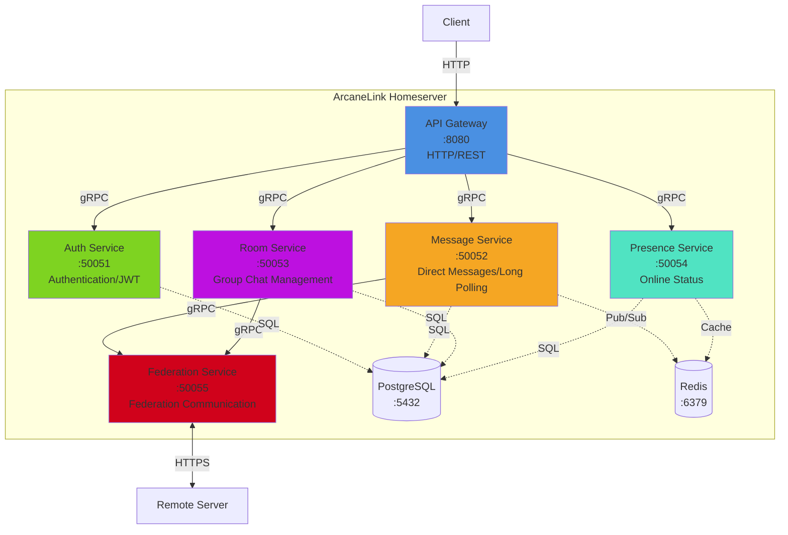

# Distributed IM Protocol

An improved distributed instant messaging protocol based on Matrix, with simplified design and enhanced performance.

## Features

- **Private chat without Room**: Direct point-to-point message routing
- **Group chat with Room**: Retains Room concept for group communication
- **HTTP long polling**: Uses standard HTTP, simpler and more compatible
- **Optional encryption**: E2EE not mandatory, reducing complexity
- **Server federation**: Decentralized architecture with cross-server communication

## Main Differences from Matrix

| Feature | Matrix | This Protocol |
|---------|--------|---------------|
| Private Chat | Uses Room | Direct P2P |
| Group Chat | Uses Room | Uses Room |
| Communication | WebSocket/HTTP | HTTP Long Polling |
| Encryption | Supports E2EE | Optional |
| Complexity | Higher | Simplified |

## System Architecture

### Microservices Relationship



### Service Responsibilities

| Service | Port | Responsibility |
|---------|------|----------------|
| API Gateway | 8080 | HTTP interface, auth middleware, rate limiting, request routing |
| Auth Service | 50051 | User registration/login, JWT generation/validation, password management |
| Message Service | 50052 | Direct messages, long polling management, message queue |
| Room Service | 50053 | Room creation/management, member management, group messages |
| Presence Service | 50054 | Online status, heartbeat detection, auto cleanup |
| Federation Service | 50055 | Server discovery, cross-domain message forwarding, retry mechanism |

### Communication Protocols

- **Client ↔ API Gateway**: HTTP/REST + Long Polling
- **API Gateway ↔ Microservices**: gRPC (internal high-performance communication)
- **Microservices ↔ Database**: PostgreSQL Protocol
- **Microservices ↔ Redis**: Redis Protocol
- **Federation ↔ Remote Server**: HTTPS/REST (cross-domain federation)

## Quick Start

### One-Click Start

Use the startup script to quickly launch all services:

```bash
./start.sh
```

This will start:
- Backend microservices (Docker containers)
- PostgreSQL database
- Redis cache
- Web frontend (development server)

Visit http://localhost:3000 to get started.

### Manual Start

#### Start Backend Services

```bash
# Start all backend services using Docker Compose
docker-compose up -d

# Check service status
docker-compose ps

# View logs
docker-compose logs -f
```

#### Start Web Client

```bash
cd web-client
npm install
npm run dev
```

The frontend will start at http://localhost:3000.

## Documentation

Complete protocol specification is available in the `spec/` directory in both Chinese and English.

### English Documentation

- [Protocol Overview](./spec/en/01-overview.md) - Design goals, core features
- [Architecture Design](./spec/en/02-architecture.md) - System architecture, dual-channel model, long polling
- [Client API](./spec/en/03-client-api.md) - Client interface specification
- [Federation API](./spec/en/04-federation-api.md) - Inter-server communication interface
- [Message Format](./spec/en/05-message-format.md) - Message and event data structures

### Chinese Documentation

- [协议概述](./spec/zh-CN/01-overview.md)
- [架构设计](./spec/zh-CN/02-architecture.md)
- [客户端API](./spec/zh-CN/03-client-api.md)
- [联邦API](./spec/zh-CN/04-federation-api.md)
- [消息格式](./spec/zh-CN/05-message-format.md)

## Basic Concepts

**User ID**: `@username:domain.com`
- Example: `@alice:example.com`

**Room ID**: `!roomid:domain.com`
- Example: `!abc123:example.com`

## Message Flow

**Private Chat**:
```
Sender Client → Sender Server → Recipient Server → Recipient Client
```

**Group Chat**:
```
Sender Client → Room Server → Member Servers → Member Clients
```

## Protocol Layers

```
Client Application Layer
    ↓
Client API Layer (HTTP Long Polling + REST API)
    ↓
Homeserver (User Management, Message Routing, Storage)
    ↓
Federation Protocol Layer (Inter-server Communication)
    ↓
Transport Layer (HTTP/1.1 or HTTP/2)
```

## API Examples

### Client Sync (Long Polling)

```http
GET /_api/v1/sync?since=token&timeout=30000
Authorization: Bearer <access_token>
```

### Send Direct Message

```http
POST /_api/v1/send_direct
Authorization: Bearer <access_token>

{
  "recipient": "@bob:example.com",
  "content": {
    "msgtype": "m.text",
    "body": "Hello"
  }
}
```

### Send Room Message

```http
POST /_api/v1/send_room
Authorization: Bearer <access_token>

{
  "room_id": "!abc123:example.com",
  "content": {
    "msgtype": "m.text",
    "body": "Hello everyone"
  }
}
```

## Implementation Recommendations

### Minimal Implementation

Core features that must be implemented:

1. User authentication
2. HTTP long polling sync
3. Direct message send/receive
4. Basic federation message forwarding

### Complete Implementation

Recommended full features:

1. Room creation and management
2. Member invitation and permissions
3. Presence management
4. Message history query
5. Multimedia message support

## Recommended Tech Stack

### Server-side

- **Language**: Go, Rust, Node.js, Python
- **Database**: PostgreSQL, MySQL, MongoDB
- **Cache**: Redis (for message queue and presence)
- **Web Framework**: HTTP framework with long polling support

### Client-side

- **Web**: JavaScript/TypeScript + React/Vue
- **Mobile**: Swift (iOS), Kotlin (Android), Flutter
- **Desktop**: Electron, Qt

## Performance Metrics

- **Long polling timeout**: 30 seconds
- **Concurrent connections per server**: 10,000+
- **Message latency**: < 100ms (same server), < 500ms (cross-server)
- **Message size limit**: 1MB

## Security Considerations

- **Transport encryption**: Mandatory HTTPS (production)
- **Authentication**: Bearer Token (JWT recommended)
- **Rate limiting**: Prevent abuse
- **Message validation**: Prevent injection attacks

## Roadmap

- [x] Protocol specification design
- [ ] Reference implementation
  - [ ] Server-side
  - [ ] Client SDK
- [ ] Testing tools
- [ ] Performance benchmarks
- [ ] Production deployment guide

## Contributing

Contributions for code, documentation improvements, and issue reports are welcome.

## License

To be determined

## Contact

For project discussions and issue reports, please use GitHub Issues.

---

**Version**: 1.0
**Status**: Draft
**Last Updated**: 2026-03-02
