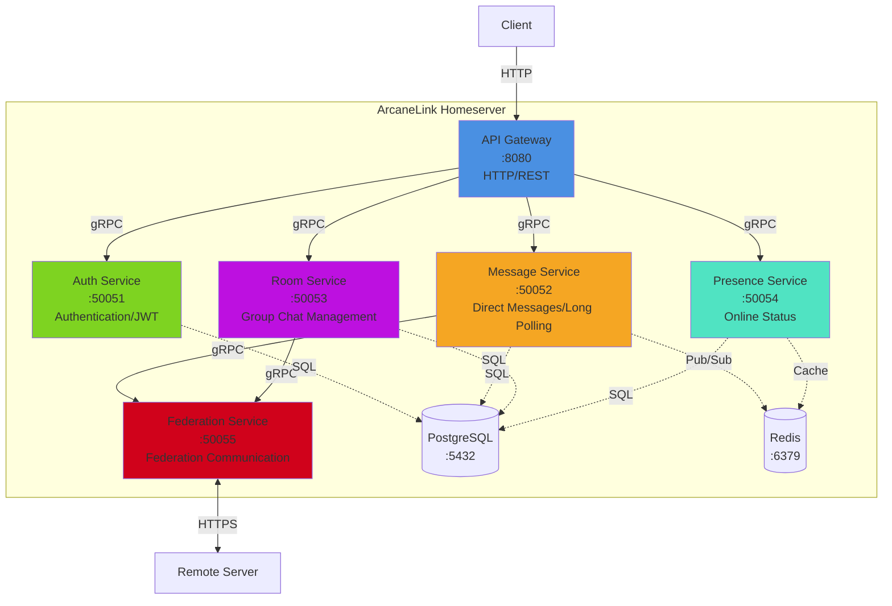

# Distributed IM Protocol

An improved distributed instant messaging protocol based on Matrix, with simplified design and enhanced performance.

## Features

- **Private chat without Room**: Direct point-to-point message routing
- **Group chat with Room**: Retains Room concept for group communication
- **HTTP long polling**: Uses standard HTTP, simpler and more compatible
- **Optional encryption**: E2EE not mandatory, reducing complexity
- **Server federation**: Decentralized architecture with cross-server communication

## Main Differences from Matrix

| Feature | Matrix | This Protocol |
|---------|--------|---------------|
| Private Chat | Uses Room | Direct P2P |
| Group Chat | Uses Room | Uses Room |
| Communication | WebSocket/HTTP | HTTP Long Polling |
| Encryption | Supports E2EE | Optional |
| Complexity | Higher | Simplified |

## System Architecture

### Microservices Relationship



### Service Responsibilities

| Service | Port | Responsibility |
|---------|------|----------------|
| API Gateway | 8080 | HTTP interface, auth middleware, rate limiting, request routing |
| Auth Service | 50051 | User registration/login, JWT generation/validation, password management |
| Message Service | 50052 | Direct messages, long polling management, message queue |
| Room Service | 50053 | Room creation/management, member management, group messages |
| Presence Service | 50054 | Online status, heartbeat detection, auto cleanup |
| Federation Service | 50055 | Server discovery, cross-domain message forwarding, retry mechanism |

### Communication Protocols

- **Client ↔ API Gateway**: HTTP/REST + Long Polling
- **API Gateway ↔ Microservices**: gRPC (internal high-performance communication)
- **Microservices ↔ Database**: PostgreSQL Protocol
- **Microservices ↔ Redis**: Redis Protocol
- **Federation ↔ Remote Server**: HTTPS/REST (cross-domain federation)

## Quick Start

### One-Click Start

Use the startup script to quickly launch all services:

```bash
./start.sh
```

This will start:
- Backend microservices (Docker containers)
- PostgreSQL database
- Redis cache
- Web frontend (development server)

Visit http://localhost:3000 to get started.

### Manual Start

#### Start Backend Services

```bash
# Start all backend services using Docker Compose
docker-compose up -d

# Check service status
docker-compose ps

# View logs
docker-compose logs -f
```

#### Start Web Client

```bash
cd web-client
npm install
npm run dev
```

The frontend will start at http://localhost:3000.

## Documentation

Complete protocol specification is available in the `spec/` directory in both Chinese and English.

### English Documentation

- [Protocol Overview](./spec/en/01-overview.md) - Design goals, core features
- [Architecture Design](./spec/en/02-architecture.md) - System architecture, dual-channel model, long polling
- [Client API](./spec/en/03-client-api.md) - Client interface specification
- [Federation API](./spec/en/04-federation-api.md) - Inter-server communication interface
- [Message Format](./spec/en/05-message-format.md) - Message and event data structures

### Chinese Documentation

- [协议概述](./spec/zh-CN/01-overview.md)
- [架构设计](./spec/zh-CN/02-architecture.md)
- [客户端API](./spec/zh-CN/03-client-api.md)
- [联邦API](./spec/zh-CN/04-federation-api.md)
- [消息格式](./spec/zh-CN/05-message-format.md)

## Basic Concepts

**User ID**: `@username:domain.com`
- Example: `@alice:example.com`

**Room ID**: `!roomid:domain.com`
- Example: `!abc123:example.com`

## Message Flow

**Private Chat**:
```
Sender Client → Sender Server → Recipient Server → Recipient Client
```

**Group Chat**:
```
Sender Client → Room Server → Member Servers → Member Clients
```

## Protocol Layers

```
Client Application Layer
    ↓
Client API Layer (HTTP Long Polling + REST API)
    ↓
Homeserver (User Management, Message Routing, Storage)
    ↓
Federation Protocol Layer (Inter-server Communication)
    ↓
Transport Layer (HTTP/1.1 or HTTP/2)
```

## API Examples

### Authentication

#### Register
```http
POST /_api/v1/auth/register
Content-Type: application/json

{
  "username": "alice",
  "password": "secret123",
  "domain": "example.com"
}
```

#### Login
```http
POST /_api/v1/auth/login
Content-Type: application/json

{
  "username": "alice",
  "password": "secret123"
}
```

### Client Sync (Long Polling)

```http
GET /_api/v1/sync?since=token&timeout=30000
Authorization: Bearer <access_token>
```

Response includes:
- `direct_messages`: New direct messages
- `room_events`: New room events (messages, member changes, etc.)
- `presence_updates`: User status changes
- `next_token`: Token for next sync

### Direct Messages

#### Send Direct Message

```http
POST /_api/v1/send_direct
Authorization: Bearer <access_token>

{
  "recipient": "@bob:example.com",
  "content": {
    "msgtype": "m.text",
    "body": "Hello"
  }
}
```

#### Get Direct Message History

```http
GET /_api/v1/direct_history?peer=@bob:example.com&limit=50
Authorization: Bearer <access_token>
```

### Room Operations

#### Create Room

```http
POST /_api/v1/rooms/create
Authorization: Bearer <access_token>

{
  "name": "My Room",
  "invite": ["@bob:example.com", "@charlie:example.com"]
}
```

#### Send Room Message

```http
POST /_api/v1/send_room
Authorization: Bearer <access_token>

{
  "room_id": "!abc123:example.com",
  "content": {
    "msgtype": "m.text",
    "body": "Hello everyone"
  }
}
```

#### Get User's Rooms

```http
GET /_api/v1/rooms
Authorization: Bearer <access_token>
```

#### Get Room Members

```http
GET /_api/v1/rooms/members?room_id=!abc123:example.com
Authorization: Bearer <access_token>
```

#### Join Room

```http
POST /_api/v1/rooms/join
Authorization: Bearer <access_token>

{
  "room_id": "!abc123:example.com"
}
```

#### Invite User to Room

```http
POST /_api/v1/rooms/invite
Authorization: Bearer <access_token>

{
  "room_id": "!abc123:example.com",
  "user_id": "@bob:example.com"
}
```

#### Leave Room

```http
POST /_api/v1/rooms/leave
Authorization: Bearer <access_token>

{
  "room_id": "!abc123:example.com"
}
```

Note: Room creators cannot leave rooms, they must delete the room instead.

#### Delete Room (Creator Only)

```http
POST /_api/v1/rooms/delete
Authorization: Bearer <access_token>

{
  "room_id": "!abc123:example.com"
}
```

Note: Deleting a room automatically removes all members.

#### Get Room State

```http
GET /_api/v1/rooms/state?room_id=!abc123:example.com
Authorization: Bearer <access_token>
```

Returns room information including the creator ID.

#### Get Link Preview

```http
GET /_api/v1/link_preview?url=https://example.com
Authorization: Bearer <access_token>
```

Returns webpage metadata (title, description, image) for displaying rich link previews.

## Implementation Recommendations

### Minimal Implementation

Core features that must be implemented:

1. User authentication
2. HTTP long polling sync
3. Direct message send/receive
4. Basic federation message forwarding

### Complete Implementation

All features have been implemented:

1. ✅ User registration and authentication (JWT-based)
2. ✅ HTTP long polling sync with real-time updates
3. ✅ Direct message send/receive with history
4. ✅ Room creation and management
5. ✅ Room messaging with real-time sync
6. ✅ Member invitation and management
7. ✅ Room member list display
8. ✅ Room deletion with permission control (creator only)
9. ✅ Room leave functionality (members only)
10. ✅ Message history loading on login
11. ✅ Emoji picker support (240+ emojis)
12. ✅ Link preview with Open Graph metadata
13. ✅ Session persistence (no logout on page refresh)
14. ✅ Presence management (basic)
15. ✅ Federation service (basic structure)

### Web Client Features

The included web client provides:

- User registration and login with session persistence
- Direct messaging with conversation history
- Room creation with member invitations
- Room messaging with real-time updates
- Room member list viewing
- Room management (invite users, leave room, delete room)
- Permission-based UI (creators can only delete, members can only leave)
- Emoji picker for messages (240+ emojis across 8 categories)
- Clickable links with rich preview cards (Open Graph metadata)
- Automatic message history loading
- Optimistic UI updates
- Responsive design

## Tech Stack

### Current Implementation

**Backend:**
- **Language**: Go 1.24
- **Database**: PostgreSQL 15
- **Cache**: Redis 7
- **Communication**: gRPC (internal), HTTP/REST (client-facing)
- **Deployment**: Docker Compose

**Frontend:**
- **Framework**: React 18 + TypeScript
- **Build Tool**: Vite
- **State Management**: Zustand
- **Routing**: React Router
- **Styling**: CSS Modules

**Architecture:**
- Microservices architecture with 6 services
- API Gateway pattern for client requests
- Long polling for real-time updates
- PostgreSQL for persistent storage
- Redis for caching and pub/sub

### Recommended Alternatives

- **Language**: Go, Rust, Node.js, Python
- **Database**: PostgreSQL, MySQL, MongoDB
- **Cache**: Redis (for message queue and presence)
- **Web Framework**: HTTP framework with long polling support

### Client-side

- **Web**: JavaScript/TypeScript + React/Vue
- **Mobile**: Swift (iOS), Kotlin (Android), Flutter
- **Desktop**: Electron, Qt

## Performance Metrics

- **Long polling timeout**: 30 seconds
- **Concurrent connections per server**: 10,000+
- **Message latency**: < 100ms (same server), < 500ms (cross-server)
- **Message size limit**: 1MB

## Security Considerations

- **Transport encryption**: Mandatory HTTPS (production)
- **Authentication**: Bearer Token (JWT recommended)
- **Rate limiting**: Prevent abuse
- **Message validation**: Prevent injection attacks

## Roadmap

- [x] Protocol specification design
- [x] Reference implementation
  - [x] Server-side (Go microservices)
  - [x] Web client (React + TypeScript)
- [x] Core features
  - [x] User registration and authentication
  - [x] Direct messaging with history
  - [x] Room creation and management
  - [x] Room messaging with real-time sync
  - [x] Room member management (invite, leave, delete)
  - [x] Permission-based room operations (creator vs member)
  - [x] Room deletion (creator only)
  - [x] Long polling sync for real-time updates
  - [x] Message history on login
  - [x] Emoji picker support
  - [x] Link preview with Open Graph metadata
  - [x] Session persistence across page refreshes
- [ ] Testing tools
- [ ] Performance benchmarks
- [ ] Production deployment guide

## Recent Updates

### 2026-03-05

**Room Management:**
- ✅ Room message sending and receiving
- ✅ Real-time message sync for all room members
- ✅ Room member list display with avatars
- ✅ Room deletion functionality (creator only)
- ✅ Room leave functionality (members only, creator cannot leave)
- ✅ User invitation to rooms with validation
- ✅ Permission-based UI (different actions for creator vs members)
- ✅ Correct member count display
- ✅ Auto-cleanup of all members when room is deleted

**Message Features:**
- ✅ Direct message history loading on login
- ✅ Room message history loading on login
- ✅ Optimistic UI updates for sent messages
- ✅ Room events processing in sync
- ✅ Emoji picker with 240+ emojis across 8 categories
- ✅ Clickable links in messages
- ✅ Rich link preview cards with Open Graph metadata
- ✅ Correct message ordering (chronological by timestamp)

**Authentication & Session:**
- ✅ Session persistence across page refreshes
- ✅ User data stored in localStorage
- ✅ Proper initialization state handling to prevent race conditions

**API Enhancements:**
- ✅ `/rooms/delete` - Delete room endpoint
- ✅ `/rooms/invite` - Invite user to room endpoint
- ✅ `/rooms/leave` - Leave room endpoint
- ✅ `/rooms/state` - Get room state (including creator info)
- ✅ `/rooms/members` - Get room members endpoint
- ✅ `/send_room` - Send room message endpoint
- ✅ `/link_preview` - Get webpage metadata for link previews
- ✅ Enhanced sync to include room events

**Bug Fixes:**
- ✅ Fixed member count calculation (was counting events instead of unique members)
- ✅ Fixed room message sync for all members
- ✅ Fixed registration error handling
- ✅ Fixed page refresh causing logout (race condition in auth initialization)
- ✅ Fixed room message ordering (messages now display chronologically)
- ✅ Fixed link preview for URLs without Open Graph tags (fallback to basic info)
- ✅ Fixed invite user validation (check if user exists before adding to room)

## Contributing

Contributions for code, documentation improvements, and issue reports are welcome.

## License

To be determined

## Contact

For project discussions and issue reports, please use GitHub Issues.

---

**Version**: 1.0.0
**Status**: Beta - Feature Complete
**Last Updated**: 2026-03-05
