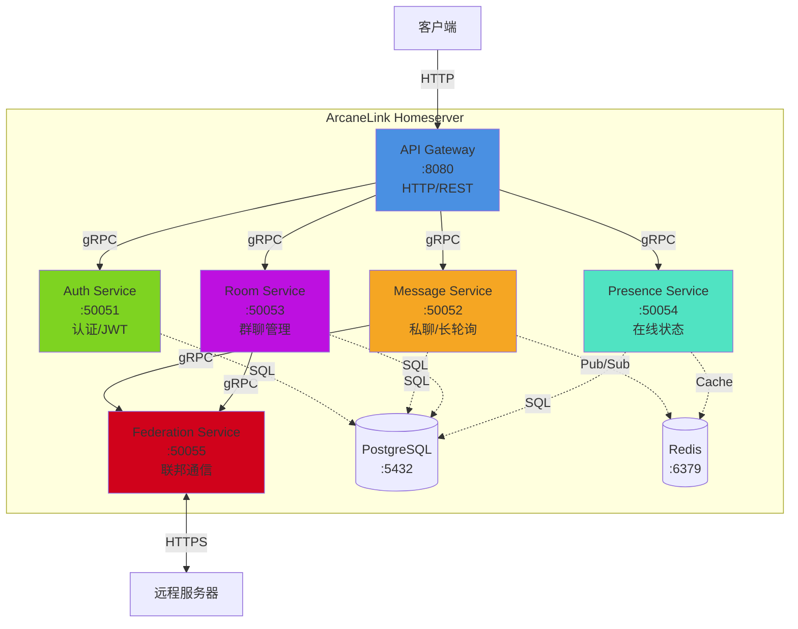

# 分布式IM通信协议

基于Matrix协议改进的分布式即时通讯协议，简化设计、提升性能。

## 特性

- **私聊不使用Room**: 消息直接点对点路由，无需创建Room对象
- **群聊使用Room**: 保留Room概念用于群组通信
- **HTTP长轮询**: 使用标准HTTP协议，更简单、更兼容
- **可选加密**: 不强制端到端加密，降低实现复杂度
- **服务器联邦**: 去中心化架构，支持跨服务器通信

## 与Matrix的主要区别

| 特性 | Matrix | 本协议 |
|-----|--------|--------|
| 私聊机制 | 使用Room | 直接点对点 |
| 群聊机制 | 使用Room | 使用Room |
| 通信方式 | WebSocket/HTTP | HTTP长轮询 |
| 加密要求 | 支持E2EE | 可选 |
| 实现复杂度 | 较高 | 简化 |

## 系统架构

### 微服务关系图



### 服务职责

| 服务 | 端口 | 职责 |
|-----|------|------|
| API Gateway | 8080 | HTTP接口、认证中间件、限流、请求路由 |
| Auth Service | 50051 | 用户注册/登录、JWT生成/验证、密码管理 |
| Message Service | 50052 | 私聊消息、长轮询管理、消息队列 |
| Room Service | 50053 | Room创建/管理、成员管理、群聊消息 |
| Presence Service | 50054 | 在线状态、心跳检测、自动清理 |
| Federation Service | 50055 | 服务器发现、跨域消息转发、重试机制 |

### 通信协议

- **客户端 ↔ API Gateway**: HTTP/REST + Long Polling
- **API Gateway ↔ 微服务**: gRPC (内部高性能通信)
- **微服务 ↔ 数据库**: PostgreSQL Protocol
- **微服务 ↔ Redis**: Redis Protocol
- **Federation ↔ 远程服务器**: HTTPS/REST (跨域联邦)

## 快速开始

### 一键启动

使用启动脚本快速启动所有服务：

```bash
./start.sh
```

这将启动：
- 后端微服务（Docker容器）
- PostgreSQL数据库
- Redis缓存
- Web前端（开发服务器）

访问 http://localhost:3000 开始使用。

### 手动启动

#### 启动后端服务

```bash
# 使用Docker Compose启动所有后端服务
docker-compose up -d

# 查看服务状态
docker-compose ps

# 查看日志
docker-compose logs -f
```

#### 启动Web前端

```bash
cd web-client
npm install
npm run dev
```

前端将在 http://localhost:3000 启动。

## 文档

完整的协议规范文档位于 `spec/` 目录，提供中英文双语版本。

### 中文文档

- [协议概述](./spec/zh-CN/01-overview.md) - 设计目标、核心特性
- [架构设计](./spec/zh-CN/02-architecture.md) - 系统架构、双通道模型、长轮询机制
- [客户端API](./spec/zh-CN/03-client-api.md) - 客户端接口规范
- [联邦API](./spec/zh-CN/04-federation-api.md) - 服务器间通信接口
- [消息格式](./spec/zh-CN/05-message-format.md) - 消息和事件数据结构

### 英文文档

- [Protocol Overview](./spec/en/01-overview.md)
- [Architecture Design](./spec/en/02-architecture.md)
- [Client API](./spec/en/03-client-api.md)
- [Federation API](./spec/en/04-federation-api.md)
- [Message Format](./spec/en/05-message-format.md)

## 基本概念

**用户ID**: `@username:domain.com`
- 示例: `@alice:example.com`

**Room ID**: `!roomid:domain.com`
- 示例: `!abc123:example.com`

## 消息流程

**私聊**:
```
发送方客户端 → 发送方服务器 → 接收方服务器 → 接收方客户端
```

**群聊**:
```
发送方客户端 → Room服务器 → 成员服务器 → 成员客户端
```

## 协议层次

```
客户端应用层
    ↓
客户端API层 (HTTP长轮询 + REST API)
    ↓
Homeserver (用户管理、消息路由、存储)
    ↓
联邦协议层 (服务器间通信)
    ↓
传输层 (HTTP/1.1 或 HTTP/2)
```

## API示例

### 客户端同步 (长轮询)

```http
GET /_api/v1/sync?since=token&timeout=30000
Authorization: Bearer <access_token>
```

### 发送私聊消息

```http
POST /_api/v1/send_direct
Authorization: Bearer <access_token>

{
  "recipient": "@bob:example.com",
  "content": {
    "msgtype": "m.text",
    "body": "Hello"
  }
}
```

### 发送群聊消息

```http
POST /_api/v1/send_room
Authorization: Bearer <access_token>

{
  "room_id": "!abc123:example.com",
  "content": {
    "msgtype": "m.text",
    "body": "Hello everyone"
  }
}
```

## 实现建议

### 最小实现

必须实现的核心功能:

1. 用户认证
2. HTTP长轮询同步
3. 私聊消息发送和接收
4. 基本的联邦消息转发

### 完整实现

建议实现的完整功能:

1. Room创建和管理
2. 成员邀请和权限
3. 在线状态管理
4. 消息历史查询
5. 多媒体消息支持

## 技术栈建议

### 服务器端

- **语言**: Go, Rust, Node.js, Python
- **数据库**: PostgreSQL, MySQL, MongoDB
- **缓存**: Redis (用于消息队列和在线状态)
- **Web框架**: 支持长轮询的HTTP框架

### 客户端

- **Web**: JavaScript/TypeScript + React/Vue
- **移动端**: Swift (iOS), Kotlin (Android), Flutter
- **桌面端**: Electron, Qt

## 性能指标

- **长轮询超时**: 30秒
- **单服务器并发连接**: 10,000+
- **消息延迟**: < 100ms (同服务器), < 500ms (跨服务器)
- **消息大小限制**: 1MB

## 安全考虑

- **传输加密**: 强制HTTPS (生产环境)
- **认证**: Bearer Token (JWT推荐)
- **速率限制**: 防止滥用
- **消息验证**: 防止注入攻击

## 开发路线图

- [x] 协议规范设计
- [ ] 参考实现
  - [ ] 服务器端
  - [ ] 客户端SDK
- [ ] 测试工具
- [ ] 性能基准测试
- [ ] 生产部署指南

## 贡献

欢迎贡献代码、文档改进和问题反馈。

## 许可证

待定

## 联系方式

项目讨论和问题反馈请使用GitHub Issues。

---

**版本**: 1.0
**状态**: 草案
**最后更新**: 2026-03-02
